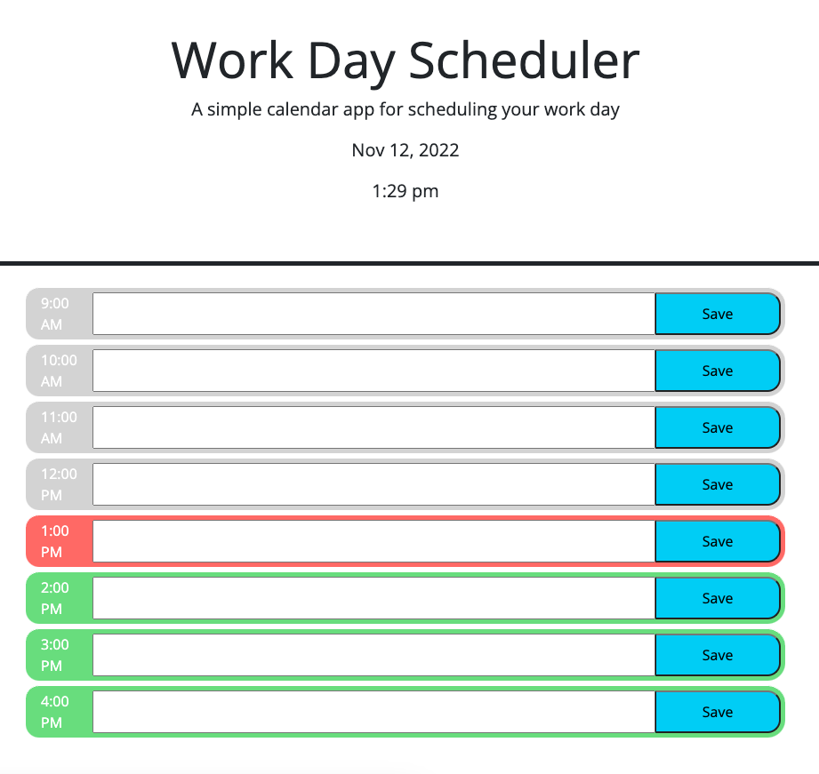

# 05 Challenge: Third-Party APIs: Work Day Scheduler

Create a daily work scheduler

## Psuedo Code:

1. Day planner page written using mostly HTMl and Day.js library in script.js file
2. When page loads current date and time displayed at the top of page
3. Page is a list of hours to schedule items in - they are color coded to indicate a) past, b) present c) future
4. When user clicks on time block they can enter info and save it
5. When they refresh page the event info is still there
6. The time block event info can be updated

## Installation

Github: https://github.com/lizedelman/Mod5Challenge

## Completed Page

## User Story

AS AN employee with a busy schedule
I WANT to add important events to a daily planner
SO THAT I can manage my time effectively

## Acceptance Criteria

GIVEN I am using a daily planner to create a schedule
WHEN I open the planner
THEN the current day is displayed at the top of the calendar
WHEN I scroll down
THEN I am presented with timeblocks for standard business hours
WHEN I view the timeblocks for that day
THEN each timeblock is color coded to indicate whether it is in the past, present, or future
WHEN I click into a timeblock
THEN I can enter an event
WHEN I click the save button for that timeblock
THEN the text for that event is saved in local storage
WHEN I refresh the page
THEN the saved events persist

## Credits

Collaborators include my tutor Michelle Jordan.

## License

License: CC0-1.0

